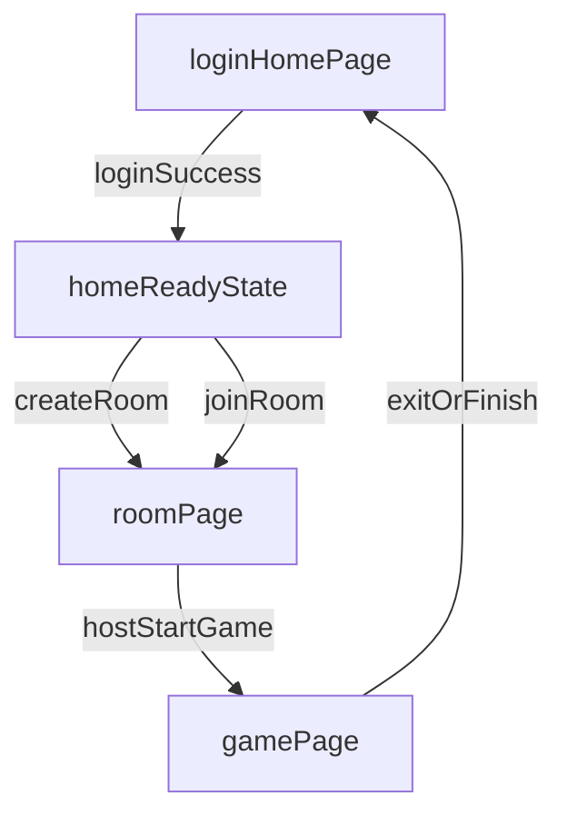

# NightDeal 用户端前端设计文档

## 1. 文档目标与范围

### 1.1 目标
- 为 NightDeal 微信小程序用户端提供可落地的前端设计基线，支持后续按任务拆分开发。
- 对齐现有工程与目标业务流程，避免“文档目标”和“代码现状”混淆。

### 1.2 范围
- 仅覆盖用户端主流程：登录、创建/加入房间、房间内协作、游戏内身份展示。
- 不覆盖商家/运营后台，不引入新的前端框架。

### 1.3 技术约束（现状）
- 平台：微信小程序（`compileType: miniprogram`）。
- 渲染与组件：`skyline` + `glass-easel`。
- 语言：TypeScript。
- 当前页面仅包含 `pages/index/index`、`pages/logs/logs`，业务页面尚未落地。

## 2. 当前现状与目标差距

### 2.1 当前已实现
- 应用壳配置：`miniprogram/app.json`。
- 首页：`miniprogram/pages/index/index`（微信登录、头像/昵称采集、创建/加入房间入口）。
- 房间页：`miniprogram/pages/room/room`（玩家列表、房主开始/踢人、Socket 实时同步）。
- 游戏页：`miniprogram/pages/game/game`（翻牌查看身份）。
- 日志页（保留示例）：`miniprogram/pages/logs/logs`。
- 可复用导航栏：`miniprogram/components/navigation-bar`。
- 业务/UI 组件：`components/ui-button`、`components/ui-card`、`components/ui-state-panel`。
- 工具层：`utils/auth.ts`（token/profile）、`utils/request.ts`（Bearer 注入 + 401 抛 `UnauthorizedError`）、`utils/socket.ts`（基于 `wx.connectSocket` 的 Socket.IO 连接封装）、`utils/config.ts`（`baseUrl`/`socketUrl` 环境路由）。

### 2.2 目标能力（来自 `DEVELOPMENT.md`）
- 首页：微信登录、创建房间、输入/扫码加入房间。
- 房间页：玩家列表、座位号、房主踢人、开始游戏。
- 游戏页：翻牌查看身份、展示玩家列表（角色对他人隐藏）。
- Socket 连接：小程序侧强制 `transports: ['websocket']`。
- 安全边界：`session_key` 禁止下发客户端，WebSocket 必须携带有效 JWT。

### 2.3 差距结论
- 主流程已基本落地（登录 → 首页 → 房间 → 游戏），剩余工作集中在“健壮性与体验”：异常文案、断线重连提示、埋点、视觉精修。
- 复用层（导航栏、UI 组件、网络/Socket 工具）已存在，新增功能应在此基础上扩展，避免重复造轮子。
- 待补充：弱网/重连体验细节、`player:updated` 事件的本地合并策略、首屏骨架与空态、埋点上报。

## 3. 信息架构与路由设计

### 3.1 页面结构
- `pages/index/index`：登录 + 首页入口（创建/加入）。
- `pages/room/room`：房间大厅与成员管理。
- `pages/game/game`：身份查看与游戏过程信息。

### 3.2 用户主流程

### 3.3 页面进入前置条件
- `index`：无前置；如本地 token 有效则可直接展示“创建/加入”卡片。
- `room`：必须拥有有效 token 且存在可用 roomCode。
- `game`：必须已加入房间且游戏已开始（从路由参数与服务端状态双校验）。

## 4. 页面级设计

### 4.1 `pages/index/index`（登录 + 首页）

#### 页面目标
- 完成微信登录并建立前端登录态。
- 提供创建房间、加入房间两个入口。

#### 关键状态
- `idle`：初始展示。
- `authorizing`：微信授权中。
- `loggingIn`：调用后端登录中。
- `ready`：登录完成，可创建/加入。
- `error`：登录失败或接口失败。

#### 核心交互
- 点击“微信登录”：调用 `wx.login`，向后端 `POST /api/auth/login` 换取 token。
- 点击“创建房间”：调用创建接口后跳转 `room`。
- 点击“加入房间”：支持输入房间码和扫码（预留）。

#### 异常态
- 登录失败：toast + 行内错误文案，提供重试。
- 无网络：展示离线提示卡片，禁用关键按钮。

#### 埋点建议
- `login_click`、`login_success`、`login_fail`。
- `create_room_click`、`join_room_click`、`join_room_fail_invalid_code`。

### 4.2 `pages/room/room`（房间页）

#### 页面目标
- 实时展示玩家与在线状态。
- 支持房主开始游戏、踢人；普通玩家等待与同步状态。

#### 关键状态
- `loading`：首次拉取房间信息。
- `ready`：玩家列表稳定展示。
- `updating`：实时事件更新中（弱加载，不遮挡 UI）。
- `reconnecting`：Socket 断线重连中。
- `error`：房间不存在/权限异常/连接失败。

#### 核心交互
- 进入页面后建立 Socket 连接（携带 JWT）。
- 房主可见“开始游戏”“踢人”操作；普通玩家不可见。
- 接收房间事件后局部刷新玩家列表与状态。

#### 异常态
- 房间不存在：提示并返回首页。
- 非法权限：提示“仅房主可操作”。
- 重连中：顶部展示非阻断状态条，保留当前列表。

#### 埋点建议
- `room_enter`、`room_socket_connected`、`room_socket_reconnecting`。
- `room_kick_click`、`room_start_click`、`room_start_success`、`room_start_fail`。

### 4.3 `pages/game/game`（游戏页）

#### 页面目标
- 仅向当前用户展示其身份牌（单人可见）。
- 展示玩家名单与游戏阶段提示，不泄露他人身份。

#### 关键状态
- `loadingRole`：拉取或恢复自己身份中。
- `roleHidden`：身份未翻开。
- `roleRevealed`：身份已翻开。
- `syncing`：同步房间游戏进度。
- `error`：身份拉取失败或状态异常。

#### 核心交互
- 点击“翻牌”执行卡片翻转动画，揭示本方角色信息。
- 支持断线恢复后重新拉取 `my-role`。

#### 异常态
- 未开局进入本页：提示并返回房间页。
- 角色加载失败：提供重试，必要时返回房间页重新同步。

#### 埋点建议
- `game_enter`、`role_reveal_click`、`role_reveal_success`、`role_reveal_fail`。

## 5. 状态管理与实时通信设计

### 5.1 前端状态域
- `authState`：`token`、`userInfo`、`tokenExpireAt`。
- `roomState`：`roomCode`、`players`、`hostUserId`、`connectionStatus`。
- `gameState`：`phase`、`myRole`、`isRoleRevealed`。

### 5.2 页面状态机（统一规范）
- 通用状态：`idle` / `loading` / `ready` / `empty` / `error` / `reconnecting`。
- 所有页面必须显式定义：
  - 进入态（entry）
  - 成功态（success/ready）
  - 错误态（error）
  - 恢复态（retry/reconnecting）

### 5.3 Socket 管理策略
- 建议集中于 `miniprogram/utils/socket.ts`（新增）。
- 连接配置遵循约束：
  - `transports: ['websocket']`
  - `auth: { token }`
  - 开启自动重连并限制次数与退避区间。
- 事件处理原则：
  - 连接类事件统一更新 `connectionStatus`。
  - 业务类事件按房间维度分发到页面数据层。
  - 服务端主动断开时触发显式重连策略。

## 6. 组件与视觉规范

### 6.1 组件分层
- 基础层：按钮、输入框、标签、空态、toast、加载态。
- 业务层：房间码输入卡、玩家列表、玩家卡片、角色卡片。
- 结构层：导航栏（复用现有 `navigation-bar`）、页面区块容器。

### 6.2 复用规则
- 所有页面统一复用 `navigation-bar`，标题、返回与显隐策略参数化。
- 重复出现的“状态展示组件”必须抽象（如 `error-panel`、`reconnect-banner`）。
- 业务组件仅处理展示与事件抛出，不直接调用网络层。

### 6.3 视觉与交互基线
- 风格关键词：简洁、低干扰、信息优先。
- 反馈层级：
  - 轻提示（toast）：非阻断信息。
  - 行内错误：可恢复问题。
  - 模态确认：踢人/开始游戏等强操作。
- 动效约束：
  - 身份翻牌为主动效，时长建议 250ms~400ms。
  - 其他状态切换以弱动效为主，避免影响实时信息读取。

## 7. API 与事件契约（前端视角）

### 7.1 HTTP 契约
- `POST /api/auth/login`
  - 入参：`{ code: string }`
  - 出参：`{ token: string, user: { id, nickName, avatarUrl } }`
- `POST /api/auth/update-profile`
  - 鉴权：`Authorization: Bearer <token>`
  - 入参：`{ nickName: string, avatarUrl: string }`
  - 出参：`{ user: { id, nickName, avatarUrl } }`

### 7.2 房间与游戏核心契约（按文档目标）
- 创建房间：返回 `roomCode` 与初始房间信息。
- 加入房间：返回当前房间快照（玩家、房主、游戏状态）。
- 获取我的角色：用于游戏开始后及断线重连恢复。

### 7.3 Socket 事件契约原则
- 入站事件（Server -> Client，与后端 `DEVELOPMENT.md §4.2 / §16.4` 对齐）：
  - 连接态：`connect` / `disconnect` / `connect_error`
  - 房间态：`room:state`（完整快照，加入即推）、`room:player-joined`、`room:player-left`、`room:offline`、`room:reconnected`、`player:updated`（玩家昵称/头像变更）
  - 游戏态：`room:started`（单播自己的角色）
  - 错误：`room:error`（`{ message }`）
- 出站事件（Client -> Server）使用后端定义的真实事件名，**不要使用 `room:create` / `room:start-game` / `room:kick-player`**：
  - `room:join` — payload `{ roomCode }`
  - `room:leave` — payload `{ roomCode }`
  - `room:start` — payload `{ roomCode }`，仅房主有效
  - `room:kick` — payload `{ roomCode, targetUserId }`，仅房主有效
  - `player:update` — payload `{ nickName?, avatarUrl? }`
- 房间“创建”不是 Socket 事件，而是 REST：`POST /api/rooms`；创建后再通过 `room:join` 加入对应房间号。
- 事件 payload 必须最小化，客户端只保存展示必要字段。

## 8. 可用性、性能与安全规范

### 8.1 可用性规范
- 页面首屏 1 秒内必须展示骨架或最小可交互状态。
- 弱网/断网时必须有明确状态提示与重试入口。
- 重连期间保留已有页面内容，避免闪屏或整页阻断。

### 8.2 性能规范
- 页面级按需加载，非首屏组件延迟初始化。
- Socket 事件节流更新列表，避免高频 setData 导致卡顿。
- 图片资源（头像等）使用合理尺寸与懒加载策略。

### 8.3 安全规范
- `session_key` 绝不存储、不打印、不透传到客户端。
- 本地仅持久化 token 与必要展示信息，敏感数据最小化缓存。
- WebSocket/HTTP 均以 JWT 作为统一认证来源。
- 严格遵循微信合法域名配置（`wss` + `https`）。

## 9. 落地优先级与分阶段计划

### 9.1 优先级定义
- `P0`：主流程可跑通（登录、创建/加入、房间同步、开始游戏、查看身份）。
- `P1`：异常与重连体验完善（弱网、断线、权限错误、空态）。
- `P2`：视觉精修与交互动效增强（翻牌体验、反馈细节、埋点完善）。

### 9.2 实施分期（与开发阶段对齐）
- M1（P0）：登录页 + 登录态管理 + 请求封装。
- M2（P0）：首页创建/加入房间。
- M3（P0/P1）：房间页 + Socket 连接与实时更新。
- M4（P0/P2）：游戏页 + 翻牌 + 角色信息恢复。
- M5（P1/P2）：联调、异常处理、样式优化、埋点补齐。

## 10. 文件落地清单（与现状对齐）
- 已落地页面：
  - `miniprogram/pages/index/index.{json,wxml,wxss,ts}`
  - `miniprogram/pages/room/room.{json,wxml,wxss,ts}`
  - `miniprogram/pages/game/game.{json,wxml,wxss,ts}`
- 已落地工具：
  - `miniprogram/utils/auth.ts`
  - `miniprogram/utils/request.ts`
  - `miniprogram/utils/socket.ts`
  - `miniprogram/utils/config.ts`
- 已落地组件：
  - `miniprogram/components/navigation-bar/*`
  - `miniprogram/components/ui-button/*`
  - `miniprogram/components/ui-card/*`
  - `miniprogram/components/ui-state-panel/*`
- 仍可考虑抽象（按需新增，存在重复展示模式时再做）：
  - `components/player-list/*`：玩家列表组件
  - `components/role-card/*`：角色翻牌组件
  - `utils/avatarUpload.ts`：若未来回切换为 OSS 直传 PostObject 方案，可抽出此工具（当前小程序端通过 `POST /api/auth/avatar/upload` 由服务端压缩并上传，未提取独立 util）。

## 11. 验收清单
- 页面与流程：用户可从登录进入并完成“创建/加入 -> 房间 -> 游戏翻牌”。
- 状态机：每个页面包含 `loading/error/reconnecting` 等可见状态。
- 实时能力：房间玩家变化可在 1 秒内同步到界面。
- 安全边界：未出现 `session_key` 客户端暴露，Socket 连接均带 JWT。
- 文档可执行：前端开发可直接据此拆解任务并实施。
