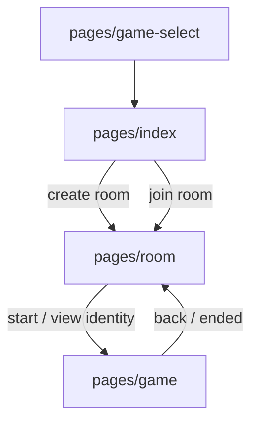

# NightDeal Frontend Development Guide

本文档描述当前微信小程序前端已经实现的页面结构、状态管理、接口契约和继续开发时应保持的约定。

## 1. 范围

当前前端覆盖用户端主流程：

- 选择游戏类型
- 微信登录和资料同步
- 创建 Avalon / SGS 房间
- 加入房间
- 房间成员实时同步
- 房主设置人数和角色
- 房主开始/结束游戏、踢人
- 当前用户身份查看

当前 Avalon 只覆盖房间和身份查看；完整组队、公投、任务、刺杀 UI 未实现。详见 [`docs/AVALON-FRONTEND.md`](./docs/AVALON-FRONTEND.md)。

不覆盖商家后台、运营后台或新的前端框架迁移。

## 2. 技术约束

| 项 | 当前实现 |
| --- | --- |
| 平台 | 微信小程序原生工程 |
| 语言 | TypeScript |
| 渲染 | Skyline |
| 组件框架 | glass-easel |
| 网络 | `wx.request` |
| 实时连接 | `wx.connectSocket` 手写 Socket.IO 协议封装 |
| 本地存储 | 微信加密 storage |

## 3. 页面结构

| 页面 | 说明 |
| --- | --- |
| `pages/game-select` | Avalon / SGS 选择入口 |
| `pages/index` | 登录、资料更新、创建/加入房间 |
| `pages/room` | 房间等待、玩家列表、房主操作和实时状态 |
| `pages/room-settings` | 房主配置人数和角色 |
| `pages/game` | 当前用户身份展示 |
| `pages/logs` | 微信模板示例页，不属于主流程 |

主流程：


```mermaid
flowchart TD
  gameSelect["pages/game-select"] --> index["pages/index"]
  index -->|"create room"| room["pages/room"]
  index -->|"join room"| room
  room -->|"start / view identity"| game["pages/game"]
  game -->|"back / ended"| room
```

## 4. 公共模块

| 文件 | 说明 |
| --- | --- |
| `utils/config.ts` | `baseUrl` 和 `socketUrl` |
| `utils/auth.ts` | token、过期时间和用户资料 storage |
| `utils/auth-guard.ts` | 页面级登录守卫 |
| `utils/request.ts` | HTTP 请求封装、响应解包、401 处理 |
| `utils/socket.ts` | Socket.IO over WeChat socket、重连和域名错误识别 |
| `utils/role-config.ts` | Avalon / SGS 默认配置和展示文案 |

组件：

| 组件 | 说明 |
| --- | --- |
| `components/navigation-bar` | 自定义导航栏 |
| `components/ui-button` | 通用按钮 |
| `components/ui-card` | 通用卡片 |
| `components/ui-state-panel` | 空态、错误态、加载态展示 |

## 5. 页面设计

### 5.1 `pages/game-select`

职责：

- 展示游戏入口
- 防止重复点击导致重复导航
- 将 `gameType=AVALON` 或 `gameType=SGS` 传给首页

### 5.2 `pages/index`

职责：

- 读取本地 token 和用户资料
- 采集头像和昵称
- 执行微信登录
- 上传头像到后端
- 同步用户资料
- 创建房间或加入房间

关键状态：

| 状态 | 说明 |
| --- | --- |
| `idle` | 空闲 |
| `authorizing` | 调用 `wx.login` |
| `loggingIn` | 调用后端登录 |
| `updatingProfile` | 更新资料 |
| `creatingRoom` | 创建房间 |
| `joiningRoom` | 加入房间 |

创建房间：

- Avalon 默认 `maxPlayers = 5`
- SGS 默认 `maxPlayers = 2`
- Avalon 会带默认 `roleConfig`
- SGS 创建时不传默认 `roleConfig`，由后端使用默认配置

### 5.3 `pages/room`

职责：

- 进入时通过 REST 拉取房间快照
- 建立 `/room` WebSocket 连接
- 监听房间事件并更新玩家列表
- 房主执行开始、结束、踢人、打开设置页
- 普通玩家等待状态同步

关键状态：

| 字段 | 说明 |
| --- | --- |
| `pageState` | `loading`、`ready`、`error` |
| `connectionStatus` | `idle`、`connecting`、`connected`、`reconnecting`、`unavailable` |
| `status` | 后端房间状态 |
| `isHost` | 当前用户是否房主 |
| `startingGame` | 开局中 |
| `endingGame` | 结束中 |

离开页面行为：

- 如果不是进入游戏页，会调用 `POST /api/rooms/:code/leave`
- 随后发出 `room:leave`
- 清理 socket 和 lastRoomCode

进入游戏页时不离开房间。

### 5.4 `pages/room-settings`

职责：

- 房主加载当前房间设置
- 根据游戏类型显示 Avalon 或 SGS 配置
- 校验角色数量是否等于 `maxPlayers`
- 防止 `maxPlayers` 小于当前玩家数
- 保存到 `PUT /api/rooms/:code/settings`

人数边界：

| 游戏 | 最小 | 最大 |
| --- | --- | --- |
| Avalon | 5 | 10 |
| SGS | 2 | 8 |

当前设置页不切换房间游戏类型；游戏类型来自房间创建时的 `gameType`。

### 5.5 `pages/game`

职责：

- 通过 `GET /api/rooms/:code/my-role` 拉取自己的角色
- 默认隐藏身份，点击后翻开
- 保持与房间 socket 的事件同步
- 游戏结束时返回房间页

关键状态：

| 状态 | 说明 |
| --- | --- |
| `loadingRole` | 正在加载身份 |
| `ready` | 身份已加载 |
| `error` | 身份加载失败 |

身份加载有 23 秒 watchdog，超时后进入错误态。

## 6. HTTP 契约

`request.ts` 会自动：

- 拼接 `config.baseUrl`
- 注入 `Authorization: Bearer <token>`
- 解包 `{ code, message, data }`
- 处理字符串 JSON 响应
- 将 401 转成 `UnauthorizedError`

当前主要接口：

| 方法 | 路径 | 用途 |
| --- | --- | --- |
| `POST` | `/api/auth/login` | 微信 code 登录 |
| `POST` | `/api/auth/update-profile` | 更新昵称和头像 |
| `POST` | `/api/auth/avatar/upload` | 上传头像 |
| `POST` | `/api/rooms` | 创建房间 |
| `GET` | `/api/rooms/:code` | 获取房间快照 |
| `POST` | `/api/rooms/:code/join` | 加入房间 |
| `POST` | `/api/rooms/:code/leave` | 离开房间 |
| `POST` | `/api/rooms/:code/start` | 开始游戏 |
| `POST` | `/api/rooms/:code/end` | 结束游戏 |
| `POST` | `/api/rooms/:code/kick` | 踢人 |
| `PUT` | `/api/rooms/:code/settings` | 更新设置 |
| `GET` | `/api/rooms/:code/my-role` | 获取自己的角色 |

## 7. WebSocket 契约

连接地址来自：

```text
config.socketUrl
```

当前默认值：

```text
wss://nightdeal.kaiwen.dev/room
```

`utils/socket.ts` 会转换为 Socket.IO Engine.IO 地址：

```text
/socket.io/?EIO=4&transport=websocket
```

连接流程：

1. `wx.connectSocket`
2. 收到 Engine.IO open packet
3. 从 storage 读取 token
4. 发送 namespace connect packet，auth payload 为 `{ token }`
5. 收到 namespace connect 后触发本地 `connect`

### 7.1 客户端发送

| 事件 | Payload | 当前发送位置 |
| --- | --- | --- |
| `room:join` | `{ roomCode }` | `pages/room`、`pages/game` |
| `room:leave` | `{ roomCode }` | `pages/room` unload |

资料更新当前走 REST `POST /api/auth/update-profile`。后端支持 `player:update` 广播资料变更，但当前页面没有把它作为主路径。

房主开始、结束、踢人和设置更新当前主要走 REST。后端也支持对应 WebSocket 事件，但前端页面没有把这些操作作为主路径。

### 7.2 客户端监听

| 事件 | 当前处理 |
| --- | --- |
| `connect` | 设置连接状态并发送 `room:join` |
| `disconnect` | 设置重连中 |
| `connect_error` | 处理域名错误或重连提示 |
| `reconnect_failed` | 弹窗提示返回或重试 |
| `room:state` | 应用全量房间状态 |
| `room:player-joined` | 插入或更新玩家 |
| `room:player-left` | 移除玩家 |
| `room:offline` | 标记玩家离线 |
| `room:reconnected` | 标记玩家在线 |
| `room:settings-updated` | 更新人数和角色配置 |
| `room:started` | 房间页进入游戏页；游戏页重新加载身份 |
| `room:ended` | 房间页提示；游戏页返回房间 |
| `room:error` | 显示错误；`KICKED` 时返回首页或上一页 |
| `player:updated` | 合并玩家昵称和头像 |

公开 `room:state` 不包含其他玩家角色。自己的角色只通过 REST `my-role` 或后端单播 `room:started` 的 `yourRole` 传递。

## 8. 本地状态

### 8.1 Auth

`utils/auth.ts` 存储：

| Key | 内容 |
| --- | --- |
| `nd_token` | JWT |
| `nd_token_exp` | JWT 过期时间 |
| `nd_user` | 用户展示资料 |

`getToken` 会检查 JWT 过期时间，过期则清理 token。

### 8.2 Room

房间页状态主要保存在页面 `data`：

- `roomCode`
- `hostId`
- `maxPlayers`
- `players`
- `roleConfig`
- `gameType`
- `status`
- `connectionStatus`

不要把完整房间状态长期写入 storage；房间数据以服务端和实时事件为准。

## 9. 安全约定

- 客户端不保存、不打印、不传递微信 `session_key`
- 所有业务 HTTP 请求通过 `request.ts` 注入 Bearer token
- WebSocket 连接从 storage 读取 token 进行认证
- 头像临时路径只能用于本地预览和上传，不能作为最终资料 URL
- 用户资料最终头像 URL 必须以后端返回的 HTTPS URL 为准
- 收到 401 时必须清理本地登录态
- 域名必须走微信合法域名配置；开发期绕过只限本地调试

## 10. 继续开发约定

- 新页面进入业务流前优先使用 `requireAuth`
- 新 HTTP 请求优先使用 `request.ts`，不要直接散落 `wx.request`
- 新房间实时事件应集中在 `utils/socket.ts` 和页面绑定处处理
- 页面离开时必须解绑 socket listener，避免重复监听
- 对后端事件名保持精确匹配，不新增文档中的别名事件
- 游戏角色相关展示不得依赖公开 `room:state`
- 修改角色配置时同时检查 `utils/role-config.ts`、后端 schema 和设置页 UI

## 11. 测试重点

- 登录、token 过期、401 回首页
- 头像上传成功、失败和 401
- Avalon / SGS 创建房间默认人数
- 加入房间码格式和后端错误展示
- 房主设置页人数和角色数量校验
- 房间页重连、离线、玩家离开、被踢
- 游戏页身份加载成功、失败、超时和游戏结束返回
