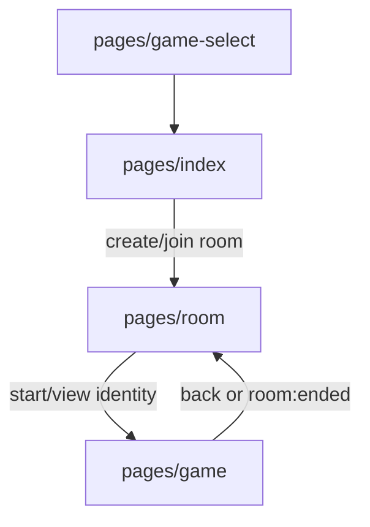

# Avalon Frontend Guide

本文档描述当前小程序端已经实现的 Avalon 能力。当前前端只支持 Avalon 房间创建、设置、开局后的身份查看；完整阿瓦隆任务流程页面仍未实现。

如果本文档与代码冲突，以当前代码为准，并同步修正文档。

## 1. 当前已实现范围

已实现：

- 在 `pages/game-select` 选择 Avalon 并进入首页
- 创建 `gameType=AVALON` 的房间
- Avalon 默认 5 人角色配置
- 房间页展示玩家、人数、房主操作和角色配置摘要
- 房主在设置页调整 Avalon 人数和角色配置
- 房主开局后进入 `pages/game`
- 游戏页通过 `GET /api/rooms/:code/my-role` 拉取当前用户自己的角色
- 游戏页默认隐藏身份，用户点击后翻开
- 监听通用 `room:started`、`room:ended`、`room:error` 事件

未实现：

- `pages/avalon-play`
- `components/avalon/*`
- `GET /api/rooms/:code/avalon/state`
- `avalon:*` WebSocket 事件
- 组队、公投、任务执行、刺杀、计分和结算 UI
- 角色视野展示
- 阿瓦隆断线重连后的专属阶段恢复

## 2. 当前页面流



当前没有独立 Avalon 对局页面。`pages/game` 是通用身份牌页面，Avalon 和 SGS 共用。

## 3. 相关文件

| 文件 | 当前职责 |
| --- | --- |
| `miniprogram/pages/game-select/game-select.*` | 选择 Avalon 或 SGS |
| `miniprogram/pages/index/index.*` | 登录、创建/加入房间 |
| `miniprogram/pages/room/room.*` | 房间等待、实时同步、房主操作 |
| `miniprogram/pages/room-settings/room-settings.*` | 调整人数和角色配置 |
| `miniprogram/pages/game/game.*` | 当前用户身份查看 |
| `miniprogram/utils/role-config.ts` | Avalon / SGS 默认配置、边界和展示文案 |
| `miniprogram/utils/request.ts` | HTTP 请求封装 |
| `miniprogram/utils/socket.ts` | Socket.IO over `wx.connectSocket` 封装 |

## 4. 创建和设置

创建 Avalon 房间时，`pages/index/index.ts` 会发送：

```ts
{
  gameType: 'AVALON',
  maxPlayers: 5,
  roleConfig: getDefaultConfig(5),
}
```

设置页当前不切换房间游戏类型；游戏类型来自创建房间时的 `gameType`。Avalon 人数范围是 5 到 10。

设置页会校验：

- `maxPlayers` 不小于当前玩家数
- 角色总数等于 `maxPlayers`
- 梅林和刺客不能关闭

服务端仍是最终校验方。前端校验只用于即时提示。

## 5. 房间页实时同步

房间页使用通用 `/room` namespace。

客户端发送：

| 事件 | Payload | 发送位置 |
| --- | --- | --- |
| `room:join` | `{ roomCode }` | 房间页连接后 |
| `room:leave` | `{ roomCode }` | ~~房间页卸载~~（PR #30 后不再发送；由 WebSocket 断连触发后端 offline） |

房主操作当前主要走 REST：

| 操作 | 接口 |
| --- | --- |
| 开始游戏 | `POST /api/rooms/:code/start` |
| 结束游戏 | `POST /api/rooms/:code/end` |
| 踢人 | `POST /api/rooms/:code/kick` |
| 更新设置 | `PUT /api/rooms/:code/settings` |

监听事件：

| 事件 | 当前处理 |
| --- | --- |
| `room:state` | 应用公开房间状态 |
| `room:player-joined` | 插入或更新玩家 |
| `room:player-left` | 移除玩家 |
| `room:offline` | 标记玩家离线 |
| `room:reconnected` | 标记玩家在线 |
| `room:settings-updated` | 更新人数和角色配置 |
| `room:started` | 进入通用身份页 |
| `room:ended` | 提示游戏已结束 |
| `room:error` | 展示错误；被踢时返回 |
| `player:updated` | 合并玩家昵称和头像 |

公开 `room:state` 不包含玩家角色。后端 `room:started` 会单播 `{ yourRole }`，但当前身份页仅通过 REST `my-role` 加载（收到 `room:started` 时重新请求）。

## 6. 身份页

`pages/game/game.ts` 当前行为：

- `onLoad` 读取 `roomCode` 和 `gameType`
- 启动 23 秒身份加载 watchdog
- 调用 `GET /api/rooms/:code/my-role`
- 根据角色名推断阵营，用于卡片样式
- 默认隐藏身份，点击卡片后显示
- 监听 `room:started` 时重新加载身份
- 监听 `room:ended` 时返回房间页

身份页不展示 Avalon 视野，也不展示任务阶段。

## 7. 后续完整 Avalon 前端实现边界

如果后端补齐完整 Avalon 状态机，前端应新增独立对局页和组件，而不是扩展当前通用身份页承载全部流程。建议新增：

- `miniprogram/pages/avalon-play/avalon-play.{ts,wxml,wxss,json}`
- `components/avalon/seat-circle`
- `components/avalon/scoreboard`
- `components/avalon/vote-card`
- `components/avalon/mission-card`
- `components/avalon/role-reveal-overlay`
- `components/avalon/assassinate-panel`
- `components/avalon/phase-banner`
- `components/avalon/vote-progress`
- `components/avalon/history-trail`

对应协议应以未来后端文档为准，至少包括 `GET /api/rooms/:code/avalon/state` 和 `avalon:*` WebSocket 事件。

这些能力当前不存在；不要在当前代码注释、README 或验收清单中把它们描述为已实现。
